## We:form 기본 ERD (Companies / Gyms / Staffs / Schedules / Sales Logs)

이 문서는 We:form ERP의 핵심 DB 구조를 한눈에 보도록 정리한 **참고용 ERD**입니다.  
구체적인 컬럼 이름·역할은 아래 테이블 설명을, 관계 구조는 Mermaid ERD 다이어그램을 참고하면 됩니다.

> ⚠️ 실제 Supabase 스키마와 다를 수 있는 초안 버전입니다.  
> 마이그레이션을 변경할 때마다 이 문서도 함께 업데이트해주세요.

---

### 0. 현재 기능 & 리팩터링 목표 요약

#### 0-1. 현재까지 구현된 주요 기능

- **인증/가입 플로우**
  - 회사 대표 가입 (`/signup` → `POST /api/auth/join-company`)
    - Supabase Auth 유저 생성 후 `companies`, `staffs`(company_admin) 레코드 생성.
    - `companies.status = 'pending'` 으로 시작하며, 시스템 관리자가 승인해야 실제 이용 가능.
  - 직원 자체 가입 (`/signup` → `POST /api/auth/signup`)
    - 기존 회사에 속하는 *가입 대기 직원*을 생성.  
    - Supabase Auth 유저 + `staffs` 레코드(`employment_status = '가입대기'`, `gym_id = null`) 생성.
  - 로그인 후 회사/직원 정보 조회 (`/login` 및 레이아웃)
    - `staffs.user_id` 를 기준으로 현재 로그인한 직원/권한/소속 지점 확인.

- **관리자 화면 (`/admin/*`)**
  - `/admin/system` (system_admin 전용)
    - 전체 `companies` 리스트, 가입 승인/상태 변경, 회사 상세로 이동.
  - `/admin/system/[id]`
    - 선택한 회사 상세/지점/직원 관리(향후 확장).
  - `/admin/hq`
    - 회사 본사 관점에서 지점/직원 현황 요약(초안).
  - `/admin/staff`
    - 특정 지점/회사 기준 직원 리스트, 가입 대기자 승인, 직원 정보/지점 이동, 신규 직원 생성 (`POST /api/admin/create-staff`).
  - `/admin/schedule` (설계 예정)
    - 지점 단위 FullCalendar 스케줄 관리 화면(ERD 상 `schedules`와 연결).

- **강사용 화면 (`/staff`)**
  - 로그인한 강사 기준 **본인 스케줄/출석 관리** 화면(초안).
  - 향후 FullCalendar `listWeek` + FAB 기반 수업 등록/상태 변경을 연동 예정.

- **시스템/지점 생성 관련 API**
  - `POST /api/admin/create-branch`
    - 새 `gyms` 레코드 생성 후, 선택한 `staffs.id` 를 지점장(`role = 'admin'`)으로 업데이트.
  - `POST /api/admin/create-staff`
    - Supabase Auth와 `staffs` 레코드(재직 직원) 동시 생성.
  - `POST /api/auth/find-company`
    - 사업자번호로 `companies` 검색하여 기존 가입 여부 확인.
  - `POST /api/admin/system/update-company`
    - `companies`의 기본 정보/상태 수정.

- **향후 연동 예정**
  - FullCalendar (지점/강사 스케줄 관리)
  - n8n Webhook (스케줄/매출 데이터 외부 전송)
  - 급여/정산(`sales_logs`, 급여 규칙 테이블 등)

#### 0-2. 이번 ERD 리팩터링의 핵심 목표

- **멀티 테넌시 구조 정리**
  - 모든 주요 도메인 테이블에서 `gym_id` / `company_id` 를 명확히 두고,  
    조회/수정 시 항상 해당 키로 필터링하는 것을 기본 원칙으로 문서화.
- **도메인 분리**
  - 회사/지점/직원(조직) 도메인  
  - 회원/매출/정산 도메인  
  - 스케줄/출석 도메인  
  을 ERD 상에서 구분해, 각 도메인별 테이블·관계를 명확히 함.
- **RLS + 권한 정책 정의**
  - `auth.uid()` → `staffs` → `companies`/`gyms` 로 이어지는 권한 체인을 기준으로,
    - system_admin / company_admin / admin / staff 권한별 허용 범위를 명시.
    - `employment_status`, `companies.status`, `gyms.status` 에 따른 접근 차단 규칙 정의.
- **상태/급여 규칙의 테이블화**
  - 출석 상태(`completed`, `no_show_deducted` 등), 급여/수당 규칙을  
    별도 코드/설정 테이블에서 관리하고, 프론트에는 하드코딩하지 않는 방향으로 정리.
- **마이그레이션/테스트 전략 수립**
  - 기존 스키마와 새 ERD 차이를 비교해,  
    “새 컬럼/테이블 추가 → API/화면 겸용 → 데이터 이전 → 구 스키마 제거” 순서의 전략을 문서로 남김.

---

### 1. Mermaid ERD

```mermaid
erDiagram

  COMPANIES {
    uuid      id                PK "회사 ID (Supabase 기본 UUID)"
    text      name              "회사명(법인명)"
    text      representative_name "대표자 이름"
    text      contact_phone     "대표 연락처"
    text      business_number   "사업자등록번호"
    text      status            "상태: pending / active / suspended"
    timestamptz created_at      "생성 일시"
  }

  GYMS {
    uuid      id                PK "지점 ID"
    uuid      company_id        FK "소속 회사 ID (companies.id)"
    text      name              "지점명"
    text      plan              "요금제 (예: enterprise)"
    text      status            "지점 상태: active / pending / closed"
    text      category          "운영 종목 (예: 헬스, PT, 필라테스...)"
    text      size              "평수 등 규모 정보"
    date      open_date         "오픈 일자"
    text      memo              "비고 / 메모"
    timestamptz created_at      "생성 일시"
  }

  STAFFS {
    uuid      id                PK "직원 ID"
    uuid      user_id           "Supabase Auth 유저 ID"
    uuid      company_id        FK "소속 회사 ID (companies.id)"
    uuid      gym_id            FK "소속 지점 ID (gyms.id), 대기자는 null"
    text      name              "직원 이름"
    text      email             "로그인 이메일"
    text      phone             "연락처"
    text      job_title         "직책 (대표, 지점장, 트레이너 등)"
    text      role              "권한: system_admin / company_admin / admin / staff / pending"
    text      employment_status "재직 상태: 재직 / 퇴사 / 가입대기 / 휴직 ..."
    date      joined_at         "입사일"
    timestamptz created_at      "생성 일시"
  }

  SCHEDULES {
    uuid      id                PK "스케줄 ID"
    uuid      gym_id            FK "지점 ID (gyms.id)"
    uuid      staff_id          FK "담당 강사 ID (staffs.id)"
    text      member_name       "회원 이름"
    text      type              "수업 유형 (PT, OT, Consulting 등)"
    text      status            "상태: reserved / completed / no_show / no_show_deducted / service"
    timestamptz start_time      "시작 일시"
    timestamptz end_time        "종료 일시"
    text      title             "캘린더용 타이틀 (옵션)"
    timestamptz created_at      "생성 일시"
  }

  SALES_LOGS {
    uuid      id                PK "매출 로그 ID"
    uuid      company_id        FK "회사 ID (companies.id)"
    uuid      gym_id            FK "지점 ID (gyms.id)"
    uuid      staff_id          FK "담당자 ID (staffs.id, 선택)"
    uuid      schedule_id       FK "연결된 수업 ID (schedules.id, 선택)"
    text      type              "구분: sale / refund / adjust 등"
    numeric   amount            "금액 (원화)"
    text      method            "결제수단: card / cash / transfer 등"
    text      memo              "비고 / 메모"
    timestamptz occurred_at     "실제 매출/환불 발생 시점"
    timestamptz created_at      "로그 생성 일시"
  }

  MEMBERS {
    uuid      id                PK "회원 ID"
    uuid      company_id        FK "회사 ID (companies.id)"
    uuid      gym_id            FK "주 이용 지점 ID (gyms.id)"
    text      name              "이름"
    text      phone             "연락처"
    date      birth_date        "생년월일"
    text      gender            "성별 (선택)"
    text      status            "상태: active / paused / expired 등"
    text      memo              "메모"
    text      profile_image_url "프로필 이미지 (Supabase Storage 경로)"
    timestamptz created_at      "등록 일시"
  }

  MEMBER_MEMBERSHIPS {
    uuid      id                PK "회원권 ID"
    uuid      gym_id            FK "지점 ID (gyms.id)"
    uuid      member_id         FK "회원 ID (members.id)"
    text      name              "상품명 (예: PT 30회)"
    int       total_sessions    "총 횟수"
    int       used_sessions     "소진 횟수"
    date      start_date        "시작일"
    date      end_date          "종료일"
    text      status            "상태: active / frozen / finished 등"
    timestamptz created_at      "생성 일시"
  }

  MEMBER_PAYMENTS {
    uuid      id                PK "결제 ID"
    uuid      company_id        FK "회사 ID (companies.id)"
    uuid      gym_id            FK "지점 ID (gyms.id)"
    uuid      member_id         FK "회원 ID (members.id)"
    uuid      membership_id     FK "연결된 회원권 ID (member_memberships.id, 선택)"
    uuid      sales_log_id      FK "연결된 매출 로그 ID (sales_logs.id, 선택)"
    numeric   amount            "결제 금액"
    text      method            "결제 수단"
    text      memo              "비고"
    timestamptz paid_at         "결제 일시"
    timestamptz created_at      "기록 생성 일시"
  }

  ATTENDANCE_STATUSES {
    text      code              PK "상태 코드 (completed / no_show 등)"
    text      label             "표시 이름 (예: 출석, 노쇼)"
    text      color             "표시 색상 (Tailwind/HEX)"
    text      description       "설명"
  }

  SALARY_SETTINGS {
    uuid      id                PK "급여 설정 ID"
    uuid      gym_id            FK "지점 ID (gyms.id)"
    text      attendance_code   FK "참조 상태 코드 (attendance_statuses.code)"
    text      pay_type          "정산 방식: fixed / rate / none 등"
    numeric   amount            "정액 또는 기본 단가"
    numeric   rate              "비율(%)"
    text      memo              "비고"
    timestamptz created_at      "생성 일시"
  }

  ATTENDANCES {
    uuid      id                PK "출석 ID"
    uuid      gym_id            FK "지점 ID (gyms.id)"
    uuid      schedule_id       FK "스케줄 ID (schedules.id)"
    uuid      staff_id          FK "담당 강사 ID (staffs.id)"
    uuid      member_id         FK "회원 ID (members.id, 선택)"
    text      status_code       FK "출석 상태 코드 (attendance_statuses.code)"
    timestamptz attended_at     "출석 처리 시각"
    text      memo              "메모"
  }

  SYSTEM_LOGS {
    uuid      id                PK "시스템 로그 ID"
    uuid      company_id        FK "회사 ID (companies.id)"
    uuid      gym_id            FK "지점 ID (gyms.id, 선택)"
    uuid      staff_id          FK "직원 ID (staffs.id, 선택)"
    text      action            "행동 키 (예: login, create_schedule)"
    jsonb     payload           "관련 데이터(JSON)"
    timestamptz created_at      "로그 시각"
  }

  %% 관계 정의
  COMPANIES ||--o{ GYMS : "1:N 회사-지점"
  COMPANIES ||--o{ STAFFS : "1:N 회사-직원"
  COMPANIES ||--o{ SALES_LOGS : "1:N 회사-매출로그"
  COMPANIES ||--o{ MEMBERS : "1:N 회사-회원"
  COMPANIES ||--o{ MEMBER_PAYMENTS : "1:N 회사-결제"
  COMPANIES ||--o{ SYSTEM_LOGS : "1:N 회사-로그"

  GYMS ||--o{ STAFFS : "1:N 지점-직원"
  GYMS ||--o{ SCHEDULES : "1:N 지점-스케줄"
  GYMS ||--o{ SALES_LOGS : "1:N 지점-매출로그"
   GYMS ||--o{ MEMBERS : "1:N 지점-회원"
   GYMS ||--o{ MEMBER_MEMBERSHIPS : "1:N 지점-회원권"
   GYMS ||--o{ MEMBER_PAYMENTS : "1:N 지점-결제"
   GYMS ||--o{ ATTENDANCES : "1:N 지점-출석"
   GYMS ||--o{ SALARY_SETTINGS : "1:N 지점-급여설정"
   GYMS ||--o{ SYSTEM_LOGS : "1:N 지점-로그"

  STAFFS ||--o{ SCHEDULES : "1:N 직원-스케줄"
  STAFFS ||--o{ SALES_LOGS : "1:N 직원-매출로그"
  STAFFS ||--o{ ATTENDANCES : "1:N 직원-출석"
  STAFFS ||--o{ SYSTEM_LOGS : "1:N 직원-로그"

  SCHEDULES ||--o{ SALES_LOGS : "1:N 수업-매출(옵션)"
  SCHEDULES ||--o{ ATTENDANCES : "1:N 수업-출석"

  MEMBERS ||--o{ MEMBER_MEMBERSHIPS : "1:N 회원-회원권"
  MEMBERS ||--o{ MEMBER_PAYMENTS : "1:N 회원-결제"
  MEMBERS ||--o{ ATTENDANCES : "1:N 회원-출석(옵션)"

  ATTENDANCE_STATUSES ||--o{ ATTENDANCES : "1:N 상태-출석"
  ATTENDANCE_STATUSES ||--o{ SALARY_SETTINGS : "1:N 상태-급여설정"
```

---

### 2. 테이블별 상세 설명

#### 2-1. `companies` – 최상위 회사(법인) 단위

- **역할**
  - We:form을 도입한 **법인/본사 단위** 회사 정보.
  - 한 회사(`companies`) 아래 여러 지점(`gyms`)과 직원(`staffs`)이 소속됩니다.
- **주요 컬럼**
  - `id (uuid)`  
    - Supabase 기본 PK.
  - `name (text)`  
    - 회사명(법인명).
  - `representative_name (text)`  
    - 대표자 이름. `join-company` 가입 폼의 `repName`.
  - `contact_phone (text)`  
    - 대표 연락처.
  - `business_number (text)`  
    - 사업자등록번호(선택).
  - `status (text)`  
    - `"pending"`: 시스템 관리자가 아직 승인을 안 한 상태.  
    - `"active"`: 서비스 이용 중.  
    - `"suspended"`: 일시 정지 등.
  - `created_at (timestamptz)`  
    - 회사 레코드 생성 시각.

> 관련 코드: `src/app/api/auth/join-company/route.ts`, `src/app/admin/system/page.tsx`

---

#### 2-2. `gyms` – 회사 내 지점(센터)

- **역할**
  - 회사(`companies`)에 속한 실제 운영 지점(헬스장/필라테스 센터 등).
  - 모든 운영 데이터(직원, 스케줄, 매출 등)는 **반드시 gym_id로 귀속**됩니다.
- **주요 컬럼**
  - `id (uuid)`  
    - 지점 PK.
  - `company_id (uuid)`  
    - 상위 회사 ID. (현재 코드에서 직접 사용되진 않지만, 멀티-회사 구조를 위해 필수로 설계합니다.)
  - `name (text)`  
    - 지점명.
  - `plan (text)`  
    - 요금제, 예: `"enterprise"`.
  - `status (text)`  
    - `"active"`: 운영 중.  
    - `"pending"`: 오픈 전 or 승인 대기.  
    - `"closed"`: 폐점.
  - `category (text)`  
    - `"헬스, PT, 필라테스"` 처럼 쉼표 문자열로 저장 (현재 코드 기준).
  - `size (text)`  
    - 평수/규모 정보(숫자를 text로 저장).
  - `open_date (date)`  
    - 오픈일.
  - `memo (text)`  
    - 지점 메모.
  - `created_at (timestamptz)`

> 관련 코드: `src/app/api/admin/create-branch/route.ts`, `src/app/admin/hq/page.tsx`

---

#### 2-3. `staffs` – 직원 / 관리자 계정

- **역할**
  - Supabase Auth `user`와 실제 센터 직원 정보를 연결하는 핵심 테이블.
  - 권한(역할), 재직 상태, 소속 회사/지점, 연락처 등 인사 정보 관리.
- **주요 컬럼**
  - `id (uuid)`  
    - 직원 PK.
  - `user_id (uuid)`  
    - Supabase Auth 유저 ID.
  - `company_id (uuid)`  
    - 상위 회사 ID (`companies.id`).  
    - 회사 대표 가입(`join-company`) 시 `company_admin`가 이 회사에 매핑됩니다.
  - `gym_id (uuid | null)`  
    - 소속 지점 ID (`gyms.id`).  
    - **가입 대기자 / 소속 미정**인 경우 `null`.
  - `name (text)`  
    - 이름.
  - `email (text)`  
    - 로그인용 이메일.
  - `phone (text)`  
    - 연락처.
  - `job_title (text)`  
    - 직책 (대표, 지점장, 트레이너, FC, 필라 강사 등).
  - `role (text)`  
    - `"system_admin"`: 전체 시스템 관리자(UI: `/admin/system`).  
    - `"company_admin"`: 회사 대표 / 본사 관리자(UI: `/admin/hq`).  
    - `"admin"`: 지점 관리자.  
    - `"staff"`: 일반 직원(강사 등).  
    - `"pending"`: 권한 미부여(가입 대기).
  - `employment_status (text)`  
    - `"재직"`, `"퇴사"`, `"가입대기"`, `"휴직"` 등.
  - `joined_at (date)`  
    - 입사일. 미입력 시 오늘 날짜로 기본 설정하는 코드가 있습니다.
  - `created_at (timestamptz)`

> 관련 코드:  
> - `src/app/api/auth/join-company/route.ts` (company_admin 생성)  
> - `src/app/api/auth/signup/route.ts` (가입대기 staff)  
> - `src/app/api/admin/create-staff/route.ts` (지점 소속 staff 생성)  
> - 다수의 페이지에서 `staffs`를 조회: 로그인, 권한 체크, HQ/직원 관리 등

---

#### 2-4. `schedules` – 수업/일정 데이터

- **역할**
  - 각 지점에서 발생하는 **수업 일정**을 관리하는 핵심 테이블.
  - FullCalendar UI(`/admin/schedule`, `/staff`)와 직접 연결됩니다.
- **주요 컬럼**
  - `id (uuid)`  
    - 스케줄 PK.
  - `gym_id (uuid)`  
    - 스케줄이 속한 지점 (`gyms.id`).  
    - **멀티 테넌시 핵심**: 항상 `gym_id`로 필터링해야 합니다.
  - `staff_id (uuid)`  
    - 담당 강사 (`staffs.id`).
  - `member_name (text)`  
    - 회원 이름 (간단 텍스트, 별도 회원 테이블과는 독립).
  - `type (text)`  
    - `"PT"`, `"OT"`, `"Consulting"` 등 수업 유형.
  - `status (text)`  
    - `"reserved"`: 예약 상태 (기본값).  
    - `"completed"`: 출석 완료.  
    - `"no_show"`: 단순 노쇼.  
    - `"no_show_deducted"`: 공제 대상 노쇼.  
    - `"service"`: 서비스/무료 수업.
  - `start_time (timestamptz)` / `end_time (timestamptz)`  
    - 수업 시작/종료 시각.
  - `title (text)`  
    - FullCalendar 표시용 타이틀 (예: `"김회원 (PT)"`).
  - `created_at (timestamptz)`

> 관련 코드:  
> - `src/app/admin/schedule/page.tsx` (지점 단위 통합 스케줄)  
> - `src/app/staff/page.tsx` (강사용 스케줄 등록/상태 변경)

---

#### 2-5. `sales_logs` – 매출/환불 로그 (예정)

- **역할**
  - 수업/결제와 연결되는 **매출·환불 기록**을 쌓는 로그 테이블(향후 구현 예정).
  - 정산, 리포트, n8n/Google Sheets 연동의 기반 데이터로 사용합니다.
- **설계 초안 컬럼**
  - `id (uuid)`  
    - 매출 로그 PK.
  - `company_id (uuid)`  
    - 회사 단위 리포트를 위해 `companies.id`를 직접 가집니다.
  - `gym_id (uuid)`  
    - 지점 단위 매출 분석용 (`gyms.id`).
  - `staff_id (uuid | null)`  
    - 담당자(트레이너/카운터 등). 없는 경우 `null`.
  - `schedule_id (uuid | null)`  
    - 특정 수업(`schedules.id`)과 직접 연결할 수 있는 경우 연결, 일반 판매(회원권 결제 등)는 `null`.
  - `type (text)`  
    - `"sale"`: 매출, `"refund"`: 환불, `"adjust"`: 조정 등.
  - `amount (numeric)`  
    - 금액 (원화 기준).
  - `method (text)`  
    - 결제 수단 (카드, 현금, 계좌이체 등).
  - `memo (text)`  
    - 비고/내역 메모.
  - `occurred_at (timestamptz)`  
    - 실제 결제/환불이 발생한 시점.
  - `created_at (timestamptz)`  
    - 로그가 시스템에 기록된 시점.

> 아직 구현 전인 테이블로, 실제로 생성할 때는 Supabase 마이그레이션과 함께 이 문서의 정의를 최신화하세요.

---

#### 2-6. `members` – 센터 회원 기본 정보

- **역할**
  - 센터를 이용하는 **회원(고객)** 의 기본 정보를 관리하는 테이블입니다.
  - 회원권, 결제, 출석 기록 등 대부분의 회원 관련 데이터의 기준이 됩니다.
- **주요 컬럼**
  - `id (uuid)`  
    - 회원 PK.
  - `company_id (uuid)` / `gym_id (uuid)`  
    - 어느 회사/지점 소속 회원인지 구분하는 멀티 테넌시 키.
  - `name (text)` / `phone (text)`  
    - 기본 인적 정보.
  - `birth_date (date)` / `gender (text)`  
    - 선택 입력. 마케팅/통계용.
  - `status (text)`  
    - `"active"`: 이용 중, `"paused"`: 일시 정지, `"expired"`: 만료 등.
  - `profile_image_url (text)`  
    - Supabase Storage 경로를 저장.

---

#### 2-7. `member_memberships` – 회원권(수강권) 정보

- **역할**
  - PT 30회권, 필라 3개월 회원권 등 **상품 단위 이용권** 정보를 저장합니다.
  - 회원 1명당 여러 회원권을 가질 수 있습니다.
- **주요 컬럼**
  - `id (uuid)`  
    - 회원권 PK.
  - `gym_id (uuid)` / `member_id (uuid)`  
    - 어느 지점, 어느 회원의 회원권인지 구분.
  - `name (text)`  
    - 상품명 (예: `"PT 30회(정가)"`).
  - `total_sessions (int)` / `used_sessions (int)`  
    - 총 횟수 / 소진 횟수.
  - `start_date (date)` / `end_date (date)`  
    - 이용 가능 기간.
  - `status (text)`  
    - `"active"`, `"frozen"`, `"finished"` 등.

---

#### 2-8. `member_payments` – 회원 결제 이력

- **역할**
  - 회원이 실제로 결제한 **결제 이력(카드/현금 등)** 을 저장합니다.
  - 매출 로그(`sales_logs`)와 1:1 또는 1:N으로 연결할 수 있도록 설계합니다.
- **주요 컬럼**
  - `id (uuid)`  
    - 결제 PK.
  - `company_id (uuid)` / `gym_id (uuid)`  
    - 회사/지점 단위 리포트용 키.
  - `member_id (uuid)` / `membership_id (uuid | null)`  
    - 어떤 회원/회원권에 대한 결제인지 연결.
  - `sales_log_id (uuid | null)`  
    - 매출 로그와 연동할 때 사용 (정산/리포트용).
  - `amount (numeric)` / `method (text)` / `paid_at (timestamptz)`  
    - 결제 금액/수단/시각.

---

#### 2-9. `attendance_statuses` – 출석 상태 코드 정의

- **역할**
  - 출석/노쇼/서비스 수업 등 **출석 상태 코드의 “사전”** 을 관리합니다.
  - 색상, 한글 라벨, 설명을 여기서 정의하고 프론트는 이 값을 그대로 사용합니다.
- **주요 컬럼**
  - `code (text)`  
    - `"completed"`, `"no_show_deducted"` 등 **변하지 않는 코드 값**.
  - `label (text)`  
    - UI에 표시할 이름 (예: `"출석"`, `"노쇼(공제)"`).
  - `color (text)`  
    - Tailwind 클래스 또는 HEX 코드 (예: `"bg-emerald-500"`).
  - `description (text)`  
    - 상태에 대한 설명.

---

#### 2-10. `salary_settings` – 출석 상태별 급여 규칙

- **역할**
  - 각 지점마다 출석 상태 코드에 따라 **어떻게 급여를 계산할지** 정의하는 테이블입니다.
  - 예: `completed` → 회당 20,000원 / `no_show_deducted` → 0원 등.
- **주요 컬럼**
  - `id (uuid)`  
    - 급여 설정 PK.
  - `gym_id (uuid)`  
    - 지점별로 서로 다른 규칙을 가질 수 있게 함.
  - `attendance_code (text)`  
    - `attendance_statuses.code` 를 참조.
  - `pay_type (text)`  
    - `"fixed"`(정액), `"rate"`(비율), `"none"`(미지급) 등.
  - `amount (numeric)` / `rate (numeric)`  
    - 급여 계산 기준 값.

---

#### 2-11. `attendances` – 실제 출석 기록

- **역할**
  - 한 스케줄에 대해 **실제 출석/노쇼 결과** 를 기록하는 테이블입니다.
  - 스케줄(`schedules`)과 분리해 두면, 과거 스케줄이라도 급여/정산 로직을 안정적으로 유지할 수 있습니다.
- **주요 컬럼**
  - `id (uuid)`  
    - 출석 PK.
  - `gym_id (uuid)` / `schedule_id (uuid)` / `staff_id (uuid)`  
    - 어느 지점/스케줄/강사에 대한 출석인지 구분.
  - `member_id (uuid | null)`  
    - 회원 테이블을 실제로 사용할 때 연결.
  - `status_code (text)`  
    - `attendance_statuses.code` 를 참조하여 상태 관리.
  - `attended_at (timestamptz)` / `memo (text)`  
    - 출석 처리 시각과 비고.

---

#### 2-12. `system_logs` – 시스템 이벤트 로그

- **역할**
  - 로그인, 스케줄 생성, 급여 정산 등 **중요 이벤트를 남기는 감사(audit) 로그** 용도입니다.
  - 장애 분석·보안·이력 조회에 활용합니다.
- **주요 컬럼**
  - `id (uuid)`  
    - 로그 PK.
  - `company_id (uuid)` / `gym_id (uuid | null)` / `staff_id (uuid | null)`  
    - 어떤 회사/지점/직원이 남긴 이벤트인지 구분.
  - `action (text)`  
    - `"login"`, `"create_schedule"`, `"update_member"` 등.
  - `payload (jsonb)`  
    - 관련 정보(JSON) – PII는 최소한만 저장.

---

### 3. 멀티 테넌시 관점에서의 요약

- **회사 단위**: `companies`  
- **지점 단위**: `gyms` (`company_id`로 상위 회사 연결)  
- **직원/권한**: `staffs` (항상 `company_id`와 `gym_id`를 통해 어느 회사/지점 소속인지 구분)  
- **운영 데이터**:  
  - 스케줄: `schedules` (반드시 `gym_id` + `staff_id` 포함)  
  - 매출: `sales_logs` (회사/지점/직원/스케줄과 연동 가능한 구조)
- **회원/출석/급여 데이터**:  
  - 회원: `members` (회사/지점 기준으로 관리)  
  - 회원권: `member_memberships` (지점별 상품 단위)  
  - 결제: `member_payments` (회사/지점/회원/회원권 연결)  
  - 출석: `attendances` + `attendance_statuses` + `salary_settings`

앞으로 DB 구조가 헷갈릴 때는:

1. **어느 회사의 데이터인가?** → `company_id`  
2. **어느 지점의 데이터인가?** → `gym_id`  
3. **어느 직원/강사의 작업인가?** → `staff_id`  

를 먼저 떠올리고, 이 `ERD.md`의 관계도를 같이 보면 전체 구조를 쉽게 이해할 수 있습니다.

---

### 4. RLS / 권한 정책 설계 초안

> 이 섹션은 **Supabase RLS 정책을 실제로 작성하기 전에** 개념을 정리하는 문서입니다.  
> 이후 SQL 마이그레이션을 만들 때 이 내용을 그대로 옮겨 적는 것을 목표로 합니다.

#### 4-1. 공통 원칙

- 로그인한 사용자는 항상 `auth.uid()` 를 통해 **Supabase Auth 유저 ID** 로 식별합니다.
- `staffs.user_id = auth.uid()` 인 레코드를 기준으로,
  - 현재 사용자의 `company_id`, `gym_id`, `role`, `employment_status` 를 가져옵니다.
- 아래 조건을 모든 RLS에서 공통으로 고려합니다.
  - `staffs.employment_status != '퇴사'`
  - `companies.status = 'active'`
  - `gyms.status = 'active'` (지점 소속인 경우)

#### 4-2. `staffs` 테이블

- **SELECT**
  - 본인: `user_id = auth.uid()` 인 레코드는 항상 조회 가능.
  - 같은 지점 관리자/본사:  
    - `role IN ('company_admin','admin','system_admin')` 인 직원은  
      - 같은 `company_id`(본사/시스템) 또는 같은 `gym_id`(지점) 의 직원을 조회할 수 있음.
- **INSERT**
  - 일반 사용자는 직접 insert 불가.  
  - 대표 가입, 직원 가입 등은 **Service Role 키를 사용하는 서버(API route)** 에서만 수행.
- **UPDATE**
  - 본인 정보(이름/전화번호 등) 일부만 수정 허용할지 여부는 추후 결정.  
  - 권한/재직 상태/지점 이동 등은 `company_admin` 이상만 수정 가능.
- **DELETE**
  - 실제 삭제는 하지 않고, `employment_status = '퇴사'` 로 관리하도록 가이드.

#### 4-3. `companies` / `gyms`

- **companies**
  - SELECT:
    - `system_admin` 은 전체 조회 가능.
    - 그 외 직원은 **자신이 속한 회사 1개**만 조회 가능 (`companies.id = staffs.company_id`).
  - INSERT/UPDATE/DELETE:
    - 모두 `system_admin` 또는 Service Role API만 허용.

- **gyms**
  - SELECT:
    - `system_admin` 은 전체.
    - `company_admin` 은 같은 회사(`company_id`)의 모든 지점.
    - `admin`/`staff` 는 자신이 속한 `gym_id` 한 건만.
  - INSERT:
    - `company_admin` 이상 또는 Service Role API (지점 생성 API).
  - UPDATE:
    - `company_admin` 이상 (지점 상태 변경 등).

#### 4-4. `schedules` / `attendances`

- **공통 필터**
  - `schedules.gym_id` / `attendances.gym_id` 는 항상 현재 사용자의  
    `staffs.gym_id` 와 일치해야만 접근 가능.

- **schedules – SELECT**
  - 같은 지점 직원/강사는 모두 볼 수 있다고 가정 (지점 일정 보드).

- **schedules – INSERT/UPDATE/DELETE**
  - `staff` 권한:
    - `schedules.staff_id = staffs.id` 인 **본인 스케줄만** 수정 가능.
    - `start_time` 이 **현재 달(YYYY-MM) 범위** 안에 있을 때만 UPDATE/DELETE 허용.
  - `admin` 이상:
    - 같은 지점(`gym_id`)의 스케줄은 과거/미래 관계없이 모두 수정 가능.

- **attendances – SELECT**
  - 같은 지점 직원은 모두 조회 가능.

- **attendances – INSERT/UPDATE**
  - 기본적으로 `schedules` 와 동일한 권한을 따르되,
    - 급여/정산 안정성을 위해 **과거 달 데이터는 `admin` 이상만 수정 가능**하게 설계.

#### 4-5. `members` / `member_memberships` / `member_payments`

- **공통 필터**
  - `company_id` / `gym_id` 가 현재 사용자의 회사/지점과 일치하는 행만 접근 가능.

- **SELECT**
  - `company_admin` / `admin` / `staff` 모두 같은 지점의 회원/회원권/결제를 조회 가능.
  - 향후 개인정보 이슈에 따라 `staff` 의 접근 범위를 더 줄일 수 있습니다.

- **INSERT/UPDATE**
  - 기본적으로 `admin` 이상이 책임지고 등록/수정.  
  - 프론트 정책에 따라 일부 화면에서 `staff` 도 신규 회원 등록 가능하게 열어둘 수 있음.

#### 4-6. `sales_logs` / `system_logs`

- **sales_logs**
  - SELECT:
    - 같은 회사/지점 데이터만 조회.
  - INSERT:
    - 결제/정산 관련 서버 로직(API, n8n 등)에서만 수행.
  - UPDATE/DELETE:
    - 원칙적으로 허용하지 않거나, `system_admin` 만 허용.

- **system_logs**
  - SELECT:
    - `system_admin` 은 전체.
    - `company_admin` 은 자신의 회사 로그만.
  - INSERT:
    - 애플리케이션 서버 코드에서만 사용 (사용자 직접 삽입 불가).

> 위 정책을 기반으로 실제 Supabase RLS SQL을 만들면,  
> 프론트/백엔드에서는 **“내가 어떤 역할/지점인지”만 알고 있으면 자동으로 안전한 범위 내에서만 접근**하게 됩니다.

---

### 5. API ↔ ERD 매핑 요약

> 현재 코드(`src/app/api/*`) 기준으로, 각 API가 어떤 테이블을 다루는지 한눈에 정리한 표입니다.

#### 5-1. Auth / 가입 도메인 (`/api/auth/*`)

- **`POST /api/auth/join-company`**
  - 관련 테이블: `companies`, `staffs`
  - 동작: 회사 대표 신규 가입
    - Supabase Auth 유저 생성 → `companies` 레코드 생성(`status = 'pending'`) → 대표자 `staffs` 레코드(`role = 'company_admin'`).
- **`POST /api/auth/find-company`**
  - 관련 테이블: `companies`
  - 동작: 사업자등록번호로 기존 회사 존재 여부 확인 (가입/조인 분기용).
- **`POST /api/auth/signup`**
  - 관련 테이블: `staffs`
  - 동작: 기존 회사에 소속될 **가입 대기 직원** 생성  
    (`employment_status = '가입대기'`, `gym_id = null` 또는 회사 기준).
- **`POST /api/auth/join`**
  - 관련 테이블: `staffs`
  - 동작: 특정 지점(`gym_id`)에 직원이 직접 입사 신청하는 플로우  
    (`employment_status = '가입대기'`, `gym_id` 지정).

#### 5-2. Admin / 조직 관리 도메인 (`/api/admin/*`)

- **`POST /api/admin/create-branch`**
  - 관련 테이블: `gyms`, `staffs`
  - 동작: 새 지점 생성 + 선택한 직원에게 지점장 권한 부여  
    (`gyms` insert, 지점장 `staffs` 레코드 `gym_id`/`role`/`employment_status` 업데이트).
- **`POST /api/admin/update-branch`**
  - 관련 테이블: `gyms`, `staffs`
  - 동작: 기존 지점 정보 수정(상태/카테고리/규모/오픈일/메모) + 지점장 교체.
- **`POST /api/admin/create-staff`**
  - 관련 테이블: `staffs`
  - 동작: 지점 관리자가 직원 계정을 직접 생성  
    (`employment_status = '재직'`, `gym_id` 지정).
- **`POST /api/admin/system/update-company`**
  - 관련 테이블: `companies`
  - 동작: 시스템 관리자가 회사 이름/대표자/연락처/상태를 수정.

#### 5-3. 외부 연동 도메인 (`/api/n8n`)

- **`POST /api/n8n`**
  - 관련 테이블: 직접적으로는 없음(단순 Proxy).
  - 동작: 클라이언트(주로 `/staff` 스케줄/출석 화면)에서 보낸 데이터를  
    n8n Webhook 으로 전달합니다.
  - 연동 대상 데이터:
    - 스케줄/출석: `schedules`, `attendances`, `attendance_statuses`
    - 회원/매출: `members`, `member_memberships`, `member_payments`, `sales_logs`
  - 향후 개선: `N8N_WEBHOOK_URL` 환경 변수를 사용해 주소를 관리하고,  
    전송 포맷을 ERD 기반 공통 스키마로 맞추는 것을 목표로 합니다.

---

### 6. 프론트엔드 화면 ↔ ERD 매핑 요약

> 주요 라우트별로 어떤 테이블 데이터를 보고/수정하는지, 어떤 역할이 사용하는 화면인지 정리합니다.

#### 6-1. 인증/가입 관련

- `/login`
  - 목적: Supabase Auth 로그인.
  - 사용 데이터: (직접 쿼리는 없지만) 로그인 후 `staffs` 를 통해 권한/지점 확인.
- `/signup`
  - 목적: 회사 대표 가입 / 직원 개별 가입 중 선택.
  - 사용 API: `/api/auth/join-company`, `/api/auth/signup`.
- `/join-company`
  - 목적: 이미 가입된 회사에 직원이 조인할 때 사용.
  - 사용 API: `/api/auth/find-company`, `/api/auth/signup`.

#### 6-2. 관리자 대시보드 (`/admin/*`)

- `/admin` (루트)
  - 목적: 로그인 후 기본 진입 대시보드 (회사/지점/직원 요약 – 향후 구현).
  - 사용 예정 데이터: `companies`, `gyms`, `staffs`, `schedules`, `sales_logs`.
- `/admin/system`
  - 대상 사용자: `system_admin`
  - 역할: 전체 `companies` 리스트 + 가입 승인/상태 변경.
  - 사용 데이터: `companies`.
- `/admin/system/[id]`
  - 대상 사용자: `system_admin`
  - 역할: 특정 회사 상세/지점/직원/이용 현황 관리 (확장 예정).
  - 사용 데이터: `companies`, `gyms`, `staffs`, (향후) `members`, `sales_logs`.
- `/admin/hq`
  - 대상 사용자: `company_admin`
  - 역할: 한 회사 안의 **모든 지점 현황** 요약 화면.
  - 사용 데이터: `gyms`, `staffs`, (향후) `members`, `sales_logs`.
- `/admin/staff`
  - 대상 사용자: `admin`(지점장) / `company_admin`
  - 역할: 직원 리스트, 가입 대기자 승인, 지점 이동, 신규 직원 생성.
  - 사용 데이터: `staffs`, `gyms`.
  - 사용 API: `/api/admin/create-staff`.
- `/admin/schedule` (예정)
  - 대상 사용자: `admin` / `company_admin`
  - 역할: 지점 단위 FullCalendar 스케줄 관리.
  - 사용 데이터: `schedules`, `attendances`, `attendance_statuses`, `salary_settings`.

#### 6-3. 강사용 화면 (`/staff/*`)

- `/staff`
  - 대상 사용자: `staff`
  - 역할: **본인 스케줄/출석** 리스트(기본 뷰: FullCalendar `listWeek`),  
    상태 변경 및 간단한 수업 메모 관리.
  - 사용 데이터: `schedules`(본인 `staff_id`), `attendances`, `attendance_statuses`, `salary_settings`.
  - 사용 API: (향후) `/api/schedules/*` 계열, `/api/n8n` (외부 연동).

> 위 매핑을 기준으로, 새 기능을 추가할 때  
> “어느 라우트에서 어느 도메인(테이블)을 건드리는지” 를 먼저 정하고 작업하면 구조가 헷갈리지 않습니다.

---

### 7. 마이그레이션 / 데이터 이전 전략

> 아직 실제 Supabase 스키마는 이 문서와 100% 동일하지 않을 수 있으므로,  
> **안전하게 단계별로** 구조를 맞춰 가는 전략을 정리합니다.

#### 7-1. 현재 스키마 vs ERD 차이 파악

- Supabase 대시보드 또는 SQL로 현재 테이블 구조를 덤프합니다.
- 이 `ERD.md` 와 비교하여:
  - 없는 테이블: `members`, `member_memberships`, `member_payments`, `attendance_statuses`, `salary_settings`, `attendances`, `system_logs`, `sales_logs` 등
  - 컬럼 차이: `companies`, `gyms`, `staffs`, `schedules` 에서 누락/이름 다른 컬럼 확인.

#### 7-2. 1단계 – 새 테이블/컬럼 추가 (기존 기능 건드리지 않기)

- 기존 로그인/직원/지점 기능에 영향이 없도록 **ADD만 수행**합니다.
  - 새 도메인 테이블 생성 (`members`, `member_memberships` …).
  - `company_id` / `gym_id` 등 멀티 테넌시 키가 빠진 테이블이 있다면 컬럼 추가.
- 이 단계에서는 RLS를 **최소한의 읽기 제한** 정도로만 두고, 실제 사용 전까지는 Service Role로만 접근하도록 설정해도 됩니다.

#### 7-3. 2단계 – API/프론트에서 새 구조를 “겸용”으로 사용

- 기존 기능을 그대로 두고, 점진적으로 새 구조를 읽도록 변경합니다.
  - 예: `/admin/staff` 리스트에서 `gyms` 조인 컬럼을 활용해 지점명을 보여주기.
  - 스케줄 화면이 준비되면 `schedules` + `attendances` 를 같이 조회하도록 구현.
- 이 단계에서는 **구/신 데이터를 둘 다 사용**하더라도 상관없게 설계합니다.

#### 7-4. 3단계 – 데이터 이전 스크립트 실행

- 필요하다면 n8n 또는 Supabase SQL 스크립트를 사용해 데이터를 옮깁니다.
  - 예: 기존 스케줄 상태 텍스트를 `attendance_statuses` 코드로 변환 후 `attendances` 테이블로 적재.
  - 기존 매출/회원 정보를 `members` / `member_memberships` / `member_payments` 로 정규화.
- 이 단계가 끝나면 **실제 운영 데이터가 새 ERD 기준 구조에 맞춰짐**.

#### 7-5. 4단계 – 구 스키마 정리 + RLS 강화

- 더 이상 사용하지 않는 컬럼/테이블을 점진적으로 제거합니다.
- RLS 정책을 이 문서의 “4. RLS / 권한 정책 설계 초안” 에 맞춰 실제 SQL로 강화합니다.
- 마지막으로, ERD 다이어그램과 이 문서를 **실제 스키마와 1:1로 맞춰서 업데이트** 하면 마이그레이션이 완료됩니다.

