# We:form ERD (Entity Relationship Diagram)

> **최종 업데이트**: 2026-01
> 이 문서는 We:form ERP의 핵심 DB 구조를 정리한 참고용 ERD입니다.

---

## 1. 시스템 개요

**We:form**은 피트니스 센터(헬스장/필라테스/PT 센터 등)를 위한 **멀티테넌시 ERP SaaS**입니다.

### 핵심 기능
- 회원 관리 및 회원권 판매
- 강사 스케줄 및 출석 관리
- 급여 정산 (템플릿 기반 계산 엔진)
- 본사-지점 계층 관리
- 대시보드 및 리포트

### 인증 시스템
- **Supabase Auth**: 이메일/비밀번호 인증
- **Supabase**: 데이터 저장 및 RLS (Row Level Security)

---

## 2. ERD 다이어그램

```mermaid
erDiagram

  %% ==========================================
  %% 조직 도메인
  %% ==========================================

  COMPANIES {
    uuid      id                PK "회사 ID"
    text      name              "회사명(법인명)"
    text      representative_name "대표자 이름"
    text      contact_phone     "대표 연락처"
    text      business_number   "사업자등록번호"
    text      status            "상태: pending / active / suspended / inactive"
    timestamptz created_at      "생성 일시"
    timestamptz updated_at      "수정 일시"
  }

  GYMS {
    uuid      id                PK "지점 ID"
    uuid      company_id        FK "소속 회사 ID"
    text      name              "지점명"
    text      status            "상태: active / pending / inactive"
    text      category          "운영 종목 (헬스, PT, 필라테스 등)"
    text      size              "규모 정보"
    date      open_date         "오픈일"
    text      memo              "비고"
    numeric   fc_bep            "FC 손익분기점"
    numeric   pt_bep            "PT 손익분기점"
    text      plan              "요금제"
    timestamptz created_at      "생성 일시"
    timestamptz updated_at      "수정 일시"
  }

  STAFFS {
    uuid      id                PK "직원 ID"
    uuid      user_id           "Supabase Auth 유저 ID"
    uuid      company_id        FK "소속 회사 ID"
    uuid      gym_id            FK "소속 지점 ID (null 가능)"
    text      name              "직원 이름"
    text      email             "이메일"
    text      phone             "연락처"
    text      job_title         "직책"
    text      role              "권한: system_admin / company_admin / admin / staff"
    text      employment_status "재직 상태: 재직 / 퇴사 / 휴직"
    date      joined_at         "입사일"
    timestamptz created_at      "생성 일시"
    timestamptz updated_at      "수정 일시"
  }

  %% ==========================================
  %% 회원 도메인
  %% ==========================================

  MEMBERS {
    uuid      id                PK "회원 ID"
    uuid      gym_id            FK "소속 지점 ID"
    text      name              "이름"
    text      phone             "연락처"
    text      email             "이메일"
    date      birth_date        "생년월일"
    text      gender            "성별: M / F"
    text      status            "상태: active / paused / expired"
    text      memo              "메모"
    timestamptz created_at      "등록 일시"
    timestamptz updated_at      "수정 일시"
  }

  MEMBERSHIP_PRODUCTS {
    uuid      id                PK "상품 ID"
    uuid      gym_id            FK "지점 ID"
    text      name              "상품명"
    text      membership_type   "유형: 헬스 / PT / 필라테스 / PPT / GX 등"
    int       default_sessions  "기본 횟수 (PT/PPT용)"
    numeric   default_price     "기본 가격"
    int       validity_months   "유효 기간 (개월)"
    int       days_per_session  "1회당 일수"
    text      description       "설명"
    boolean   is_active         "활성 여부"
    int       display_order     "표시 순서"
    timestamptz created_at      "생성 일시"
    timestamptz updated_at      "수정 일시"
  }

  MEMBER_MEMBERSHIPS {
    uuid      id                PK "회원권 ID"
    uuid      gym_id            FK "지점 ID"
    uuid      member_id         FK "회원 ID"
    uuid      product_id        FK "상품 ID"
    uuid      sales_staff_id    FK "판매 담당자 ID"
    text      registration_type "등록 유형: new / renewal / extension"
    int       total_sessions    "총 횟수"
    int       used_sessions     "소진 횟수"
    int       service_sessions  "서비스(보너스) 세션 총 횟수"
    int       used_service_sessions "사용된 서비스 세션 횟수"
    date      start_date        "시작일"
    date      end_date          "종료일"
    numeric   amount            "결제 금액"
    numeric   amount_excl_vat   "VAT 제외 금액"
    text      status            "상태: active / frozen / finished"
    timestamptz created_at      "생성 일시"
    timestamptz updated_at      "수정 일시"
  }

  MEMBER_PAYMENTS {
    uuid      id                PK "결제 ID"
    uuid      gym_id            FK "지점 ID"
    uuid      company_id        FK "회사 ID"
    uuid      member_id         FK "회원 ID"
    uuid      membership_id     FK "회원권 ID"
    text      membership_type   "회원권 유형"
    text      membership_name   "상품명"
    int       sessions          "횟수"
    int       bonus_sessions    "서비스(보너스) 세션"
    int       duration_months   "기간(개월)"
    text      sale_type         "판매 유형"
    numeric   unit_price        "단가"
    numeric   amount            "결제 금액"
    text      payment_method    "결제 수단"
    text      registrar         "등록자 (수기입력)"
    uuid      staff_id          FK "담당자 ID"
    uuid      created_by        FK "결제 기록 생성자 ID"
    text      trainer_name      "트레이너 이름"
    text      memo              "메모"
    date      payment_date      "결제일"
    timestamptz created_at      "생성 일시"
    timestamptz updated_at      "수정 일시"
  }

  %% ==========================================
  %% 스케줄 도메인
  %% ==========================================

  SCHEDULES {
    uuid      id                PK "스케줄 ID"
    uuid      gym_id            FK "지점 ID"
    uuid      staff_id          FK "담당 강사 ID"
    uuid      member_id         FK "회원 ID (선택)"
    text      member_name       "회원 이름 (텍스트)"
    text      title             "캘린더 타이틀"
    text      schedule_type     "유형: inside / outside / weekend / holiday"
    text      status            "상태: scheduled / completed / cancelled / no_show / no_show_deducted"
    timestamptz start_time      "시작 일시"
    timestamptz end_time        "종료 일시"
    boolean   is_locked         "잠금 여부"
    uuid      report_id         FK "보고서 ID"
    timestamptz created_at      "생성 일시"
    timestamptz updated_at      "수정 일시"
  }

  MONTHLY_SCHEDULE_REPORTS {
    uuid      id                PK "보고서 ID"
    uuid      staff_id          FK "직원 ID"
    uuid      gym_id            FK "지점 ID"
    uuid      company_id        FK "회사 ID"
    text      year_month        "년월: YYYY-MM"
    jsonb     stats             "통계 데이터"
    text      status            "상태: draft / submitted / approved / rejected"
    timestamptz submitted_at    "제출 일시"
    timestamptz reviewed_at     "검토 일시"
    uuid      reviewed_by       FK "검토자 ID"
    text      admin_memo        "관리자 메모"
    timestamptz created_at      "생성 일시"
    timestamptz updated_at      "수정 일시"
  }

  ATTENDANCES {
    uuid      id                PK "출석 ID"
    uuid      gym_id            FK "지점 ID"
    uuid      schedule_id       FK "스케줄 ID"
    uuid      staff_id          FK "담당 강사 ID"
    uuid      member_id         FK "회원 ID (선택)"
    text      status_code       "출석 상태 코드"
    timestamptz attended_at     "출석 일시"
    text      memo              "메모"
    timestamptz created_at      "생성 일시"
  }

  ATTENDANCE_STATUSES {
    text      code              PK "상태 코드"
    text      label             "표시 이름"
    text      color             "표시 색상"
    text      description       "설명"
  }

  %% ==========================================
  %% 급여 도메인
  %% ==========================================

  JOB_POSITIONS {
    uuid      id                PK "직무 ID"
    uuid      gym_id            FK "지점 ID"
    text      code              "직무 코드: trainer / fc_staff / manager 등"
    text      name              "직무명"
    text      description       "설명"
    timestamptz created_at      "생성 일시"
    timestamptz updated_at      "수정 일시"
  }

  SALARY_VARIABLES {
    uuid      id                PK "변수 ID"
    uuid      gym_id            FK "지점 ID"
    text      variable_name     "변수명"
    text      display_name      "표시명"
    text      data_type         "데이터 타입: number / boolean / string"
    text      data_source       "데이터 소스"
    text      aggregation_method "집계 방법"
    text      description       "설명"
    timestamptz created_at      "생성 일시"
    timestamptz updated_at      "수정 일시"
  }

  SALARY_COMPONENTS {
    uuid      id                PK "구성요소 ID"
    uuid      gym_id            FK "지점 ID"
    text      name              "구성요소명"
    text      category          "카테고리: base / allowance / lesson / incentive / bonus"
    text      description       "설명"
    int       display_order     "표시 순서"
    boolean   is_active         "활성 여부"
    timestamptz created_at      "생성 일시"
    timestamptz updated_at      "수정 일시"
  }

  CALCULATION_RULES {
    uuid      id                PK "규칙 ID"
    uuid      component_id      FK "구성요소 ID"
    text      job_position_code "적용 직무 코드"
    int       priority          "우선순위"
    jsonb     condition         "조건식 (JSON)"
    jsonb     calculation       "계산식 (JSON)"
    boolean   enabled           "활성 여부"
    text      description       "설명"
    timestamptz created_at      "생성 일시"
    timestamptz updated_at      "수정 일시"
  }

  MONTHLY_PERFORMANCES {
    uuid      id                PK "실적 ID"
    uuid      staff_id          FK "직원 ID"
    text      year_month        "년월: YYYY-MM"
    jsonb     metrics           "실적 데이터 (JSON)"
    boolean   auto_calculated   "자동 계산 여부"
    timestamptz calculated_at   "계산 일시"
    timestamptz created_at      "생성 일시"
    timestamptz updated_at      "수정 일시"
  }

  CALCULATED_SALARIES {
    uuid      id                PK "급여 ID"
    uuid      staff_id          FK "직원 ID"
    text      year_month        "년월: YYYY-MM"
    jsonb     breakdown         "급여 내역 (JSON)"
    numeric   total_amount      "총액"
    numeric   previous_month_total "전월 총액"
    numeric   diff_amount       "차액"
    numeric   diff_rate         "증감률 (%)"
    timestamptz calculated_at   "계산 일시"
    timestamptz created_at      "생성 일시"
    timestamptz updated_at      "수정 일시"
  }

  FC_LEVEL_ASSIGNMENTS {
    uuid      id                PK "레벨 배정 ID"
    uuid      staff_id          FK "직원 ID"
    text      year_month        "년월: YYYY-MM"
    int       level             "레벨: 1~5"
    uuid      assigned_by       FK "배정자 ID"
    text      notes             "비고"
    timestamptz assigned_at     "배정 일시"
    timestamptz created_at      "생성 일시"
  }

  SALARY_SETTINGS {
    uuid      id                PK "설정 ID"
    uuid      gym_id            FK "지점 ID"
    text      attendance_code   FK "출석 상태 코드"
    text      pay_type          "정산 방식: fixed / rate"
    numeric   amount            "금액"
    numeric   rate              "비율 (%)"
    text      memo              "비고"
    timestamptz created_at      "생성 일시"
    timestamptz updated_at      "수정 일시"
  }

  %% ==========================================
  %% 이벤트/공지 도메인
  %% ==========================================

  COMPANY_EVENTS {
    uuid      id                PK "이벤트 ID"
    uuid      company_id        FK "회사 ID"
    uuid      gym_id            FK "지점 ID (선택)"
    text      title             "제목"
    text      content           "내용"
    date      event_date        "이벤트 일자"
    boolean   is_active         "활성 여부"
    timestamptz created_at      "생성 일시"
    timestamptz updated_at      "수정 일시"
  }

  SYSTEM_ANNOUNCEMENTS {
    uuid      id                PK "공지 ID"
    text      title             "제목"
    text      content           "내용"
    text      priority          "우선순위: normal / important / urgent"
    boolean   is_active         "활성 여부"
    uuid      author_id         FK "작성자 ID"
    timestamptz created_at      "생성 일시"
    timestamptz updated_at      "수정 일시"
  }

  %% ==========================================
  %% 지출 관리 도메인
  %% ==========================================

  GYM_EXPENSES {
    uuid      id                PK "지출 ID"
    uuid      company_id        FK "회사 ID"
    uuid      gym_id            FK "지점 ID"
    date      expense_date      "지출일"
    text      category          "카테고리"
    text      sub_category      "세부 카테고리"
    text      description       "설명"
    numeric   amount            "금액"
    text      payment_method    "결제 수단"
    text      vendor            "거래처"
    text      receipt_memo      "영수증 메모"
    uuid      created_by        FK "등록자 ID"
    timestamptz created_at      "생성 일시"
    timestamptz updated_at      "수정 일시"
  }

  EXPENSE_CATEGORIES {
    uuid      id                PK "카테고리 ID"
    uuid      gym_id            FK "지점 ID"
    uuid      company_id        FK "회사 ID"
    text      name              "카테고리명"
    int       display_order     "표시 순서"
    timestamptz created_at      "생성 일시"
  }

  %% ==========================================
  %% 회원-트레이너 관리 도메인
  %% ==========================================

  MEMBER_TRAINERS {
    uuid      id                PK "배정 ID"
    uuid      gym_id            FK "지점 ID"
    uuid      company_id        FK "회사 ID"
    uuid      member_id         FK "회원 ID"
    uuid      trainer_id        FK "트레이너 ID"
    text      category          "종목 (헬스/필라테스/골프 등)"
    boolean   is_primary        "주 담당 여부"
    text      status            "상태: active / transferred"
    uuid      assigned_by       FK "배정자 ID"
    timestamptz assigned_at     "배정 일시"
    timestamptz created_at      "생성 일시"
    timestamptz updated_at      "수정 일시"
  }

  MEMBER_TRAINER_TRANSFERS {
    uuid      id                PK "인계 ID"
    uuid      gym_id            FK "지점 ID"
    uuid      company_id        FK "회사 ID"
    uuid      member_id         FK "회원 ID"
    uuid      member_trainer_id FK "배정 ID"
    text      category          "종목"
    uuid      from_trainer_id   FK "이전 트레이너 ID"
    uuid      to_trainer_id     FK "새 트레이너 ID"
    text      reason            "인계 사유: resignation / leave / member_request / workload / other"
    text      reason_detail     "상세 사유"
    uuid      transferred_by    FK "처리자 ID"
    timestamptz transferred_at  "인계 일시"
    timestamptz created_at      "생성 일시"
  }

  MEMBER_ACTIVITY_LOGS {
    uuid      id                PK "로그 ID"
    uuid      gym_id            FK "지점 ID"
    uuid      company_id        FK "회사 ID"
    uuid      member_id         FK "회원 ID"
    uuid      membership_id     FK "회원권 ID"
    text      action_type       "작업 유형: member_created / member_updated / membership_created / etc"
    text      description       "변경 내용 요약"
    jsonb     changes           "변경 전/후 값: { before, after }"
    uuid      created_by        FK "처리자 ID"
    timestamptz created_at      "생성 일시"
  }

  %% ==========================================
  %% 관계 정의
  %% ==========================================

  %% 조직 관계
  COMPANIES ||--o{ GYMS : "1:N 회사-지점"
  COMPANIES ||--o{ STAFFS : "1:N 회사-직원"
  COMPANIES ||--o{ COMPANY_EVENTS : "1:N 회사-이벤트"
  COMPANIES ||--o{ MONTHLY_SCHEDULE_REPORTS : "1:N 회사-보고서"

  GYMS ||--o{ STAFFS : "1:N 지점-직원"
  GYMS ||--o{ MEMBERS : "1:N 지점-회원"
  GYMS ||--o{ MEMBERSHIP_PRODUCTS : "1:N 지점-상품"
  GYMS ||--o{ SCHEDULES : "1:N 지점-스케줄"
  GYMS ||--o{ ATTENDANCES : "1:N 지점-출석"
  GYMS ||--o{ MONTHLY_SCHEDULE_REPORTS : "1:N 지점-보고서"
  GYMS ||--o{ JOB_POSITIONS : "1:N 지점-직무"
  GYMS ||--o{ SALARY_VARIABLES : "1:N 지점-급여변수"
  GYMS ||--o{ SALARY_COMPONENTS : "1:N 지점-급여구성요소"
  GYMS ||--o{ SALARY_SETTINGS : "1:N 지점-급여설정"

  %% 회원 관계
  MEMBERS ||--o{ MEMBER_MEMBERSHIPS : "1:N 회원-회원권"
  MEMBERS ||--o{ SCHEDULES : "1:N 회원-스케줄"
  MEMBERS ||--o{ ATTENDANCES : "1:N 회원-출석"
  MEMBERSHIP_PRODUCTS ||--o{ MEMBER_MEMBERSHIPS : "1:N 상품-회원권"

  %% 직원 관계
  STAFFS ||--o{ SCHEDULES : "1:N 직원-스케줄"
  STAFFS ||--o{ ATTENDANCES : "1:N 직원-출석"
  STAFFS ||--o{ MONTHLY_SCHEDULE_REPORTS : "1:N 직원-보고서"
  STAFFS ||--o{ MEMBER_MEMBERSHIPS : "1:N 직원-판매"
  STAFFS ||--o{ MONTHLY_PERFORMANCES : "1:N 직원-실적"
  STAFFS ||--o{ CALCULATED_SALARIES : "1:N 직원-급여"
  STAFFS ||--o{ FC_LEVEL_ASSIGNMENTS : "1:N 직원-FC레벨"

  %% 스케줄/출석 관계
  SCHEDULES ||--o{ ATTENDANCES : "1:N 스케줄-출석"
  MONTHLY_SCHEDULE_REPORTS ||--o{ SCHEDULES : "1:N 보고서-스케줄"
  ATTENDANCE_STATUSES ||--o{ ATTENDANCES : "1:N 상태-출석"
  ATTENDANCE_STATUSES ||--o{ SALARY_SETTINGS : "1:N 상태-급여설정"

  %% 급여 관계
  SALARY_COMPONENTS ||--o{ CALCULATION_RULES : "1:N 구성요소-규칙"

  %% 지출 관계
  GYMS ||--o{ GYM_EXPENSES : "1:N 지점-지출"
  GYMS ||--o{ EXPENSE_CATEGORIES : "1:N 지점-지출카테고리"
  STAFFS ||--o{ GYM_EXPENSES : "1:N 직원-지출등록"

  %% 결제 관계
  MEMBERS ||--o{ MEMBER_PAYMENTS : "1:N 회원-결제"
  MEMBER_MEMBERSHIPS ||--o{ MEMBER_PAYMENTS : "1:N 회원권-결제"

  %% 회원-트레이너 관계
  MEMBERS ||--o{ MEMBER_TRAINERS : "1:N 회원-트레이너배정"
  STAFFS ||--o{ MEMBER_TRAINERS : "1:N 트레이너-회원배정"
  MEMBERS ||--o{ MEMBER_TRAINER_TRANSFERS : "1:N 회원-인계이력"
  MEMBER_TRAINERS ||--o{ MEMBER_TRAINER_TRANSFERS : "1:N 배정-인계"

  %% 회원 활동 로그 관계
  MEMBERS ||--o{ MEMBER_ACTIVITY_LOGS : "1:N 회원-활동로그"
```



---

## 3. 역할(Role) 체계

| Role | 설명 | 접근 범위 |
|------|------|----------|
| `system_admin` | 전체 시스템 관리자 | 모든 회사/지점 접근 |
| `company_admin` | 회사 본사 관리자 | 소속 회사의 모든 지점 |
| `admin` | 지점 관리자 | 소속 지점만 |
| `staff` | 일반 직원/강사 | 본인 데이터만 |

---

## 4. 주요 테이블 설명

### 4-1. 조직 도메인

#### `companies` - 회사(법인)
- We:form을 도입한 최상위 단위
- `status`: 가입 승인 상태 관리 (`pending` → `active`)

#### `gyms` - 지점(센터)
- 회사 하위의 실제 운영 지점
- `fc_bep`, `pt_bep`: 손익분기점 목표 매출

#### `staffs` - 직원
- `user_id`: Supabase Auth 인증 연동
- `role`: 권한 레벨
- `employment_status`: 재직 상태

### 4-2. 회원 도메인

#### `members` - 회원
- 센터를 이용하는 고객 정보

#### `membership_products` - 회원권 상품
- 지점별 판매 상품 정의
- `membership_type`: 헬스, PT, 필라테스 등

#### `member_memberships` - 회원권(구매 기록)
- 회원이 구매한 실제 회원권
- `registration_type`: 신규/재등록/연장

### 4-3. 스케줄 도메인

#### `schedules` - 스케줄
- PT/수업 일정
- `status`: 예약됨 → 완료/노쇼/취소
- `is_locked`: 월간 보고서 제출 후 잠금

#### `monthly_schedule_reports` - 월간 보고서
- 월별 스케줄 제출/승인 관리
- `status`: draft → submitted → approved/rejected

#### `attendances` - 출석 기록
- 스케줄과 분리된 출석 이력

### 4-4. 급여 도메인

#### `job_positions` - 직무 정의
- 지점별 커스텀 직무 (트레이너, FC, 매니저 등)

#### `salary_components` - 급여 구성요소
- 기본급, 수당, 레슨비, 인센티브, 보너스 등

#### `calculation_rules` - 계산 규칙
- 직무별/조건별 급여 계산 로직 (JSON)
- 계산 타입: fixed, formula, tiered, conditional

#### `monthly_performances` - 월별 실적
- 매출, PT 횟수, OT 횟수 등 실적 데이터

#### `calculated_salaries` - 계산된 급여
- 규칙 기반으로 계산된 최종 급여

---

## 5. RLS (Row Level Security) 정책 가이드

### 5-1. 공통 원칙

```sql
-- 현재 사용자의 staff 정보 조회 (이메일 기반 매칭)
SELECT * FROM staffs WHERE email = auth.jwt()->>'email';

-- 권한 체인: auth → staffs → company_id / gym_id
```

### 5-2. 테이블별 정책

| 테이블 | SELECT | INSERT/UPDATE | DELETE |
|--------|--------|---------------|--------|
| `companies` | system_admin: 전체, 그 외: 본인 회사만 | system_admin만 | 불가 |
| `gyms` | company_admin: 회사 전체, admin/staff: 본인 지점 | company_admin 이상 | 불가 |
| `staffs` | 같은 회사/지점 | admin 이상 | 소프트 삭제 (employment_status) |
| `members` | 같은 지점 | admin 이상 | 불가 |
| `schedules` | 같은 지점 | staff: 본인 + 현재 달만, admin: 전체 | admin 이상 |
| `attendances` | 같은 지점 | staff: 본인, admin: 전체 | admin 이상 |

---

## 6. API ↔ 테이블 매핑

### 인증/온보딩
| API | 관련 테이블 |
|-----|------------|
| `/api/auth/find-company` | companies |
| `/api/onboarding/company` | companies, staffs |
| `/api/onboarding/staff` | staffs |
| `/api/auth/callback` | staffs (Supabase Auth 콜백) |

### 관리자
| API | 관련 테이블 |
|-----|------------|
| `/api/admin/dashboard/stats` | schedules, members, member_memberships |
| `/api/admin/members` | members, member_memberships |
| `/api/admin/staffs` | staffs |
| `/api/admin/schedule/*` | schedules, monthly_schedule_reports |
| `/api/admin/hq/*` | gyms, staffs, company_events |
| `/api/admin/system/*` | companies, gyms, staffs |

### 스케줄/출석
| API | 관련 테이블 |
|-----|------------|
| `/api/schedule/*` | schedules |
| `/api/schedule/submit` | monthly_schedule_reports |
| `/api/schedule/approve` | monthly_schedule_reports, schedules |
| `/api/attendance/records` | attendances |

### 급여
| API | 관련 테이블 |
|-----|------------|
| `/api/salary` | calculated_salaries, monthly_performances |

---

## 7. 급여 계산 엔진

### 7-1. 계산 흐름

```
1. 월간 실적 수집 (monthly_performances)
   ↓
2. 직무별 규칙 조회 (calculation_rules)
   ↓
3. 조건 평가 & 계산식 실행
   ↓
4. 구성요소별 금액 합산
   ↓
5. 급여 저장 (calculated_salaries)
```

### 7-2. 계산 타입

| 타입 | 설명 | 예시 |
|------|------|------|
| `fixed` | 고정 금액 | 기본급 200만원 |
| `formula` | 수식 계산 | `pt_count * 13500` |
| `tiered` | 구간별 차등 | 10건 이하: 10,000원, 11~20건: 12,000원 |
| `conditional` | 조건 분기 | FC 레벨별 인센티브 |

### 7-3. 조건 문법

```json
// 비교 조건
{ "type": "comparison", "field": "pt_count", "operator": ">=", "value": 50 }

// 논리 조건 (AND)
{ "type": "and", "conditions": [...] }

// 논리 조건 (OR)
{ "type": "or", "conditions": [...] }

// 항상 적용
{ "type": "always" }

// 기본값 (else)
{ "type": "else" }
```

---

## 8. 데이터 흐름

### 8-1. 회원 등록 → 급여 반영

```
1. 회원 등록 (members)
   ↓
2. 회원권 구매 (member_memberships)
   - sales_staff_id: 판매 담당자
   - registration_type: new/renewal/extension
   ↓
3. 월말 집계 (monthly_performances)
   - personal_sales, new_member_sales 등
   ↓
4. 급여 계산 (calculated_salaries)
   - 판매 인센티브 반영
```

### 8-2. 스케줄 → 급여 반영

```
1. 스케줄 생성 (schedules)
   ↓
2. 출석 처리 (status → completed/no_show)
   ↓
3. 월간 보고서 제출 (monthly_schedule_reports)
   ↓
4. 관리자 승인 (status → approved)
   - schedules.is_locked = true
   ↓
5. 월말 집계 (monthly_performances)
   - pt_total_count, pt_inside_count 등
   ↓
6. 급여 계산 (calculated_salaries)
   - 레슨 수당 반영
```

---

## 9. 마이그레이션 히스토리

| 버전 | 파일 | 내용 |
|------|------|------|
| 001 | `001_salary_system.sql` | 급여 시스템 기본 테이블 |
| 002 | `002_schedule_system.sql` | 스케줄 시스템 |
| 003 | `003_member_management.sql` | 회원 관리 |
| 004 | `004_salary_templates.sql` | 급여 템플릿 |
| 005 | `005_gym_settings.sql` | 지점 설정 (BEP) |
| 006 | `006_announcements.sql` | 회사 이벤트 |
| 007 | `007_cleanup.sql` | 미사용 테이블 정리 |
| 008 | `008_system_announcements.sql` | 시스템 공지 |
| 009 | `009_schedule_subtype.sql` | 스케줄 서브타입 |
| 010 | `010_format_phone_numbers.sql` | 전화번호 포맷 |
| 011 | `011_sales_custom_options.sql` | 판매 커스텀 옵션 |
| 012 | `012_addon_membership_type.sql` | 애드온 회원권 타입 |
| 013 | `013_allow_null_member_id.sql` | member_id null 허용 |
| 014 | `014_update_registration_type.sql` | 등록 타입 업데이트 |
| 015 | `015_add_gpt_membership_type.sql` | GPT 회원권 타입 추가 |
| 015b | `015b_enable_rls.sql` | RLS 정책 적용 |
| 016 | `016_member_activity_logs.sql` | 회원 활동 로그 |
| 017 | `017_member_membership_transfers.sql` | 회원권 양도 |
| 018 | `018_fix_monthly_reports_rls.sql` | 월간보고서 RLS 수정 |
| 019 | `019_add_expenses.sql` | 지출 관리 테이블 |
| 020 | `020_update_expenses.sql` | 지출 테이블 업데이트 |
| 021 | `021_add_sub_category.sql` | 세부 카테고리 추가 |
| 022 | `022_fix_members_company_id.sql` | members company_id 수정 |
| 023 | `023_add_service_sessions.sql` | 서비스 세션 컬럼 추가 |
| 024 | `024_add_registrar_to_payments.sql` | 결제 등록자 컬럼 |
| 025 | `025_member_trainers.sql` | 회원-트레이너 배정 테이블 |
